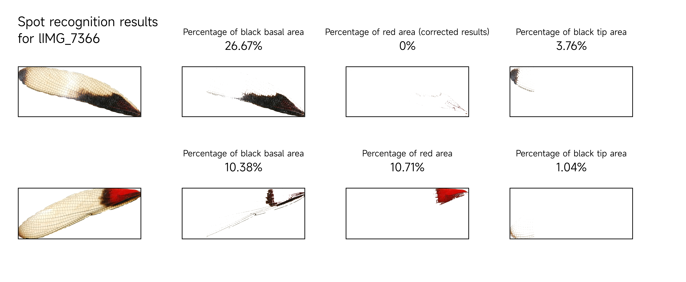

# A command line program to analyze damselfly wing spots

This application is part of my graduation thesis, developed using Python, [detectron2](https://github.com/facebookresearch/detectron2) deep learning framework and OpenCV to identify and crop damselfly wings, and to Identify and calculate the area of plaques on the target, and finally export the required data table. At the same time, this application is preset with two types of damselfly wing recognition models, based on standard photos and perching in Drury, JP's paper [ecog-04469](https://www.ecography.org/appendix/ecog-04469) photos from training.

The application can be used through the command line and does not have a corresponding graphical interface, but it can be customized by modifying `config.py`. For details, please see the [Usage](##Usage) chapter. If you want to know how the application processes images, please see the [Process Detail](##Process Detail) chapter.

## Installation

This application has been verified to function under the following conditions:
- OS: Debian 10.10 x64
- Python: Python 3.9
- GPU: P4000, and other CUDA enabled GPUs

Theoretically, the program can be used normally if the corresponding Python and CUDA development environments are configured in the Windows environment.

In terms of configuring the python environment, it is recommended to use conda to manage the environment. For conda installation, please refer to this [link](https://docs.conda.io/projects/conda/en/latest/user-guide/install/linux.html) .

CUDA Toolkit also needs to be installed correctly. For the installation tutorial, see this [link](https://developer.nvidia.com/cuda-downloads). Before installation, please ensure that your host or server is equipped with a graphics card that supports CUDA.

After completing the prerequisites, execute the following commands in the command line to deploy the Python environment:

```shell
git clone https://github.com/barberry-nut/wing_damselfly.git
cd wing_damselfly
conda create -n wing_damselfly
conda activate wing_damselfly
pip -r requirements.txt
```

Subsequently, you need to install detectron2 separately, please follow its [official tutorial](https://github.com/facebookresearch/detectron2/blob/main/INSTALL.md) for installation.

After completing the installation of detectron2, you need to execute the following commands to download two pre-trained models, or manually download the pre-trained models to `models` folder on the [hugging face page](https://huggingface.co/barberry-nut/wing_damselfly).

```shell
wget -P ./models https://huggingface.co/barberry-nut/wing_damselfly/resolve/main/perching_model_final.pth
wget -P ./models https://huggingface.co/barberry-nut/wing_damselfly/resolve/main/standard_model_final.pth
```

After completing the model download, execute `python main.py` in the root directory of the application. When you see the command line starting to read the sample images and output parameters, it means that the program has been successfully run.

## Usage

### Customize Config

In the `config.py` file, you can customize relevant parameters. For the meaning of all parameters, please refer to the comments in the file code.

Generally, you need to focus on the three bool variables `is_separate`, `is_perching`, and `used_model`, which determine the running requirements and mode of the program.

The project is preset with a set of config that has been verified, and corresponding folders such as `models` and `photos` are created based on the config. When the program runs, it will check if the folder set in config has been created correctly, and if not, it will be created automatically.

### Custom Models

The program is preset with pre-trained detectron2 models and corresponding yaml files for `standard photos` and `perching photos`. If you need to use a custom model, please refer to this [official document](https://detectron2.readthedocs.io/en/latest/tutorials/getting_started.html) for training.

At the same time, you may need to use [labelme](https://github.com/wkentaro/labelme) to produce the data set, and use this [script](https://github.com/INF800/labelme_to_detectron2) to perform labelme Conversion of format to detectron2 format. Please place the trained model file according to the definition of `config.py`.

### Import Images

You need to place the photos or pictures to be processed in the specified folder. This folder is specified by the `photos_folder` variable in `config.py`. Please use jpg or png format for photos or images.

### Customize Report CSV

In the `report_template` file, you can find two preset csv report templates for standard photos and perching photos. Generally, you only need to copy the required template to the `report_file_path` variable in `config.py` specified path, the program can run normally.

If you need to customize the report file, you can customize the relevant fields in the csv according to the template. For more advanced customization requirements, you need to modify the code.

### Run Application

After completing all configurations, please return to the root directory of this project, make sure you have switched to the correct conda environment, and execute on the command line:

```
python main.py
```

When the command line starts to load the model and displays the file names of the images you need to process, it means that the program has been executed correctly.

### Remove Cache

When you want to remove the files generated by the last run, you can execute del.sh in command line like `bash del.sh` under the photos file. This script will remove the `detectron2_segmenter`, `detectron2_recognizer`, `rembg_segmenter`, `extractor` folders. But the csv files in the `report` folder will not be deleted. You need to manually clean the csv file to prevent new results from being added to the last report file.

## Issues

If you have any questions about using the program, please feel free to communicate in the issue.

## Examples


